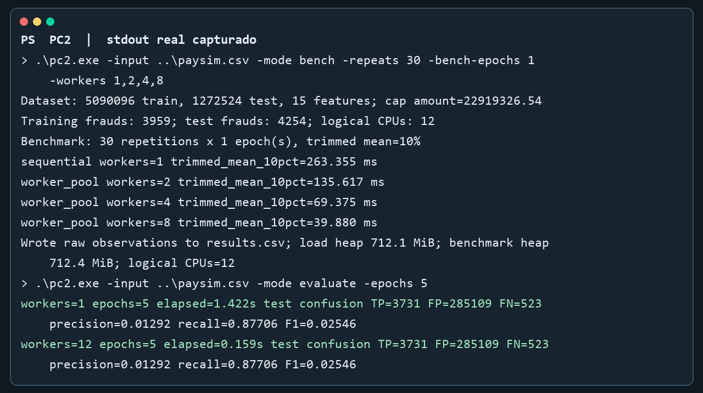

# CC65 PC2 - Detección de fraude en PaySim1

## 1. Correcciones de PC1 y alcance

Este entregable conserva el análisis bibliográfico, el caso de uso y el procedimiento de limpieza de PC1 y añade el modelado concurrente, la implementación en Go y la evaluación solicitada para PC2. Se usó `paysim.csv`, el CSV original completo con 6,362,620 transacciones; los archivos de `data-limpia/` son muestras, no la matriz limpia completa.

Al recalcular el pipeline sobre el CSV se corrigieron tres cifras publicadas en PC1:

| Dato | Cifra anterior | Resultado reproducible |
| --- | ---: | ---: |
| Percentil 99.99 de `amount` | USD 9,615,000 | USD 22,919,326.54 |
| Fraudes en entrenamiento cronológico (80%) | 5,651 | 3,959 |
| Fraudes en prueba cronológica (20%) | 2,562 | 4,254 |
| Predictores después de codificación | 14 | 15 |

El dataset mantiene 8,213 fraudes en total. La división respeta el orden cronológico del CSV: 5,090,096 registros para entrenamiento y 1,272,524 para prueba. La estandarización usa media y desviación poblacional calculadas solo con entrenamiento; el umbral de recorte se obtiene con el percentil interpolado 99.99 del conjunto completo, como en el flujo previo de limpieza.

## 2. Modelo y características

Se implementó regresión logística binaria con descenso por gradiente batch y ponderación de clases. Para una fila con vector de características `x`, etiqueta `y` y parámetros `w,b`, la probabilidad estimada es `p = sigmoid(w·x+b)`. El error se pondera con 0.5006 para la clase legítima y 387.35 para la clase fraude, y se promedia sobre las filas de entrenamiento. Se usa tasa de aprendizaje 0.1 y regularización L2 de 0.0001 sobre los pesos. El sesgo no se regulariza.

Las 15 características, en orden, son `step`, `amount`, los cuatro saldos originales, `errorBalanceOrig`, `errorBalanceDest`, `hora_del_dia`, `dia_de_la_semana`, cuatro indicadores de `type` (CASH_OUT, DEBIT, PAYMENT, TRANSFER) y `dest_type_M`. Las columnas de identificadores y la bandera heurística `isFlaggedFraud` se excluyen. El código calcula el percentil, deriva características, estima el escalador y prepara las particiones directamente desde el CSV completo.

## 3. Implementación secuencial y worker pool

Ambas variantes ejecutan la misma actualización del modelo y usan las mismas filas y parámetros. La versión secuencial acumula gradiente de cada fila en una sola goroutine. La versión concurrente divide el rango de filas en segmentos contiguos y los envía por un canal de trabajos a un conjunto fijo de workers. Cada worker calcula un gradiente parcial privado y lo envía por un canal con capacidad suficiente. La goroutine principal recibe todos los parciales, los reduce en un único gradiente y actualiza los pesos una vez por época.

Pseudocódigo de la versión concurrente:

```text
inicializar pesos y sesgo
repetir por época:
    crear canal de trabajos y canal de resultados
    iniciar W workers
    enviar a cada worker un rango disjunto de filas
    cada worker calcula y publica su gradiente parcial local
    cerrar trabajos; esperar a los workers; cerrar resultados
    reducir resultados en el coordinador
    actualizar pesos y sesgo una sola vez
```

La exclusión de escrituras compartidas se obtiene por diseño: ningún worker modifica los pesos ni el gradiente de otro; solo el coordinador reduce y aplica la actualización después de recibir los resultados. Se usan goroutines, canales y `sync.WaitGroup` de la biblioteca estándar de Go. No se requiere `Mutex` porque no hay estado mutable compartido entre workers.

## 4. Modelo Promela

`pc2/sync.pml` abstrae dos workers y un coordinador. Cada worker marca su parcial privado como listo y envía su identificador por un canal acotado. El coordinador verifica que el parcial exista y no haya sido consumido, registra cada resultado una sola vez y actualiza el estado compartido una sola vez después de recibir ambos resultados. Las aserciones comprueban que se consumieron los dos parciales y que el número de actualizaciones es exactamente uno.

La estructura del modelo cubre las intercalaciones de envío y recepción sin acceso concurrente de los workers al estado del modelo. El ejecutable Spin no está instalado en el entorno disponible (tampoco hay gestor de paquetes en WSL), por lo que el análisis exhaustivo del archivo Promela no pudo ejecutarse aquí. La verificación formal con Spin queda pendiente; no se presenta como resultado ya comprobado.

## 5. Medición de rendimiento

Se midió una pasada completa de gradiente sobre las 5,090,096 filas de entrenamiento. Se ejecutaron 30 repeticiones por configuración; se descartaron los tres tiempos menores y los tres mayores y se promediaron los 24 restantes (media recortada al 10%). La medición cronometra el cómputo, la coordinación de workers, la reducción y la actualización; excluye lectura del CSV, cálculo del percentil y estandarización. El entorno reportó Windows x64, Go 1.27.0 y 12 procesadores lógicos.

| Configuración | Media recortada (ms) | Speedup | Eficiencia sobre N workers |
| --- | ---: | ---: | ---: |
| Secuencial | 263.355 | 1.000x | - |
| Worker pool, 2 | 135.617 | 1.942x | 97.1% |
| Worker pool, 4 | 69.375 | 3.796x | 94.9% |
| Worker pool, 8 | 39.880 | 6.604x | 82.6% |

`Speedup = tiempo secuencial / tiempo concurrente`; la eficiencia es `speedup / workers`. La latencia bajó de 263.355 ms a 39.880 ms al pasar a ocho workers. El crecimiento casi lineal indica que este cálculo batch se beneficia de dividir filas y reducir solo 15 acumuladores por worker. La eficiencia menor al 100% refleja coordinación, reducción y variaciones del sistema; las mediciones no implican que otros tamaños de datos o máquinas obtengan la misma curva.

## 6. Recursos, calidad del modelo y trade-offs

Durante la medición el proceso empleó en promedio 0.2594, 0.2620, 0.2667 y 0.3016 segundos de CPU para las configuraciones secuencial, 2, 4 y 8 workers respectivamente. El heap asignado observado después de cargar las matrices fue de aproximadamente 712 MiB. La CPU usada crece levemente al paralelizar por la coordinación y ejecución de varias goroutines, mientras que el tiempo de pared cae de manera marcada. El punto de equilibrio práctico de esta carga medida se alcanza con dos workers; cuatro y ocho siguen mejorando la latencia en el equipo usado.

Como comprobación funcional, se entrenó cinco épocas con la versión secuencial y con la concurrente usando 12 workers. Ambas dieron la misma matriz de confusión en prueba: 3,731 verdaderos positivos, 285,109 falsos positivos y 523 falsos negativos. Con umbral 0.5, esto equivale a recall 87.71%, precisión 1.29% y F1 2.55%. La ponderación favorece la detección de fraudes, pero genera muchos falsos positivos; se necesita selección de umbral y evaluación de precisión-recall antes de cualquier uso operativo. Esta evaluación funcional no se mezcló con los tiempos de una época del benchmark.

El speedup medido corresponde al núcleo de gradiente sobre datos ya residentes en memoria. La preparación del dataset requiere tres pasadas por el CSV y no se incluye en esa métrica; por ello el speedup de extremo a extremo será menor. La carga es limitada por lectura de memoria y cálculo de sigmoid, y aumentar workers también aumenta el uso simultáneo de CPU. Para datasets pequeños, la creación y coordinación de workers puede costar más que el trabajo paralelo.

## 7. Reproducibilidad y evidencias

Desde la carpeta `pc2/`:

```powershell
go run . -input ..\paysim.csv -mode bench -repeats 30 -bench-epochs 1 -workers 1,2,4,8 -out results.csv
go run . -input ..\paysim.csv -mode evaluate -epochs 5
```

Las observaciones individuales están en `pc2/results.csv`. El código fuente es `pc2/main.go`; el modelo está en `pc2/sync.pml`; la guía está en `pc2/README.md`. La figura siguiente se generó directamente desde la salida stdout capturada del programa; el CSV conserva cada repetición para comprobar los promedios. Las limitaciones principales son la falta de verificación Spin ejecutada y que solo se midió una pasada de gradiente a cuatro niveles de paralelismo en una máquina.


